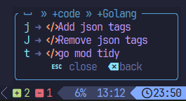

# 💤 LazyVim (Golang + Flutter + Dart + WSL)

# Why?

There are my favourite plugins and settings, in future I'll also extend it with snippets - I am working on multiple devices so it's great to sync configs between.


# How to?

## Pre requirements
- First of all install `neovim`
- `git`
- `curl`
- `rust` with `cargo` package manager
- `tree-sitter` (Should be shipped with neovim and available from your `$PATH`)

### If you're using WSL
Clipboard wont work unless you'll configure it, the required configs are already in this repo, anyway you'll need to install [Win32Yank]([/guides/content/editing-an-existing-page#modifying-front-matter](https://github.com/equalsraf/win32yank/releases)) Just download release and unpack into place where your **$PATH** is configure.

# Troubleshoting
## General
Use `:LazyHealth` and resolve at least problems, in ideal scenario also warnings for the most optimal results

## Windows WSL
open windows terminal (without WSL) and type win32yank.exe - if it was not found, google how to setup **$PATH** on windows


## Backup config
Skip if you don't care

```bash
mv ~/.config/nvim{,.bak}

mv ~/.local/share/nvim{,.bak}
mv ~/.local/state/nvim{,.bak}
mv ~/.cache/nvim{,.bak}
```

## Installation
```bash
git clone https://github.com/marosiak/lazyvim-go-dart ~/.config/nvim
```


## Updating

### Update my configs

`cd ~/.config/nvim && git pull`

### Update plugins versions

Open nvim, go into Lazy tab and sync


# Keymaps

There are a lot of keymaps from lazyvim https://www.lazyvim.org/keymaps


# Languages
## Golang
### Keymaps
Press `<leader>cg` in order to see extra features, for now just a few, but there are more LSP oriented just in `<leader>c`
-   


### Commands
Common ones: `:GoBuild` `:GoRun` `:GoStop` `:GoTest` `:GoCoverage`
You can close appearing terminal with `GoTermClose` or just `<leader>w` (basically use window navigations)
https://github.com/ray-x/go.nvim?tab=readme-ov-file#build-and-test
